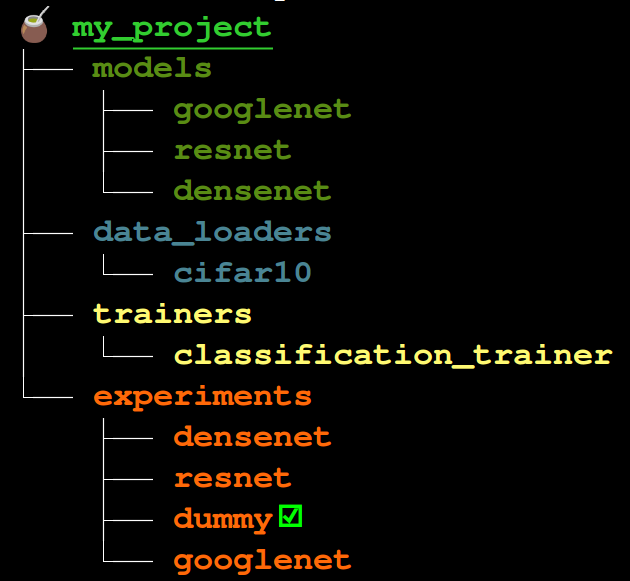

<h1 style="color:green"><span style="color:green">Maté 🧉</span></h1>

Maté is a deep learning framework compatible with pytorch(lightning), tensorflow(keras), and jax(flax). It is a package and experiment manager for deep learning. As a package manager you can add AI models, trainers and data loaders to your projects. As a project manager, Maté evaluates, trains, and keeps track of your experiments. Maté adds the source code of the dependencies to your project, making it fully customizable and reproducible.

<div style="width:100vw; text-align:center">
  
</div>


## Installation 🔌

```bash
pip install yerbamate
```

## Examples

Please check out the [examples repo](https://github.com/ilex-paraguariensis/examples/) for examples of pytorch lightning, keras and jax.

## Quick Start ⚡

**Train a model**

```bash
mate train my_experiment
```

**Evaluate a model**

```bash
mate test my_experiment
```

**Run a model**

```bash
mate run feature_extraction my_experiment
```

**Clone a model**

```bash
mate clone resnet my_resnet
```

More features coming soon!

## Comparison to familiar tools

- *Weights & Biases* wandb is a logger and allows model weights sharing as well
- *Tensorboard* This is a logger and can be integrated into mate
- *[Monai](https://github.com/Project-MONAI/MONAI)*
- *[Ivy](https://github.com/unifyai/ivy)*
- *[THINGSvision](https://github.com/ViCCo-Group/thingsvision)*


## What is the Maté standard?
Mate enforces modularity and seperation of three basic components of a deep learning project: models, trainers, and data loaders. Each model, data loader, and trainer. Each model, data loader and trainer should be a module inside its respective folder. This allows for out-of-the-box sharing of models, data loaders, and trainers. 

An example of a the foolder structure of a mate project is shown below:

```
├── root_project_folder
│   ├── data
│   │   ├── __init__.py
│   │   ├── cifar
│   │   │   ├── __init__.py
│   │   │   ├── cifar10.py
|
│   ├── models
│   │   ├── __init__.py
│   │   ├── resnet
│   │   │   ├── __init__.py
│   │   │   ├── resnet.py
|
│   ├── trainers
│   │   ├── __init__.py
│   │   ├── classifier
│   │   │   ├── __init__.py
│   │   │   ├── classifier.py
|
│   ├── experiments
│   │   ├── resnet18_cifar10.json
│   │   ├── resnet34_cifar10.json

```


## For Coders
Dear coders, we try our best to not get in your way and in fact, you do not have to integrate or import any mate class to your projects. Mate simply parses the configuration. To make your project mate compatible, you need to move a few files and make a Bombilla configuration file. 

### Mate configuration (AKA Bombilla 🧉)
Mate defines an experiment with a configuration file, aka Bombilla, that is a ordered dictionary describing arguments and python objects in plain json. Bombilla supports any python module; including all the local project level modules and installed py packages (eg., tensorflow, pytorch, x_transformers, torchvision, vit_pytorch). Mate generates objects in a Bombilla with DFS search. 

**Note that all the arguments are directly passed to the object constructor, so you can use any argument that is accepted by the fucntion call.**

Here you can see some examples of objects in Bombilla format:
* custom neural network that fine tunes a pretrained resnet:
```
            "classifier": {
                "module": "modules.resnet.fine_tune",
                "class": "ResNetTuneModel",
                "object_key": "classifier",
                "params": {
                    "num_classes": 10,
                    "resnet": {
                        "module": "torchvision.models",
                        "class": "resnet18",
                        "params": {
                            "pretrained": true
                        }
                    }
                }
            },


```
* **Pytorch lightning trainer**

```
    "trainer": {
        "module": "pytorch_lightning",
        "class": "Trainer",
        "params": {
            "gpus": 1,
            "max_epochs": 100,
            "precision": 16,
            "gradient_clip_val": 0.5,
            "enable_checkpointing": true,
            "callbacks": [
                {
                    "module": "pytorch_lightning.callbacks",
                    "class": "EarlyStopping",
                    "params": {
                        "monitor": "val_loss",
                        "patience": 10,
                        "mode": "min"
                    }
                },
                {
                    "module": "pytorch_lightning.callbacks",
                    "class": "ModelCheckpoint",
                    "params": {
                        "dirpath": "{save_dir}/checkpoints",
                        "monitor": "val_loss",
                        "save_top_k": 1,
                        "verbose": true,
                        "save_last": true,
                        "mode": "min"
                    }
                }
            ],
            "logger": {
                "module": "pytorch_lightning.loggers",
                "class": "WandbLogger",
                "params": {
                    "project": "cifar10",
                    "name": "vit_vanilla",
                    "save_dir": "./logs",
                    "log_model": false
                }
            }
        }
    
```


**More tutorials and examples will be added soon!!**


## FAQ
**Q: Does Maté work with colab?**

**A**: Yes! Maté works with colab as any Maté project is exportable to a juypter notebook.

## Contact 🤝 

For questions please contact:

yerba.mate.dl(at)proton.me
